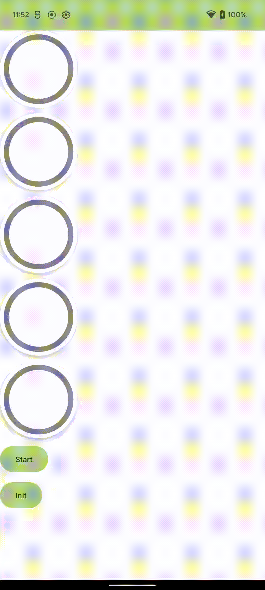
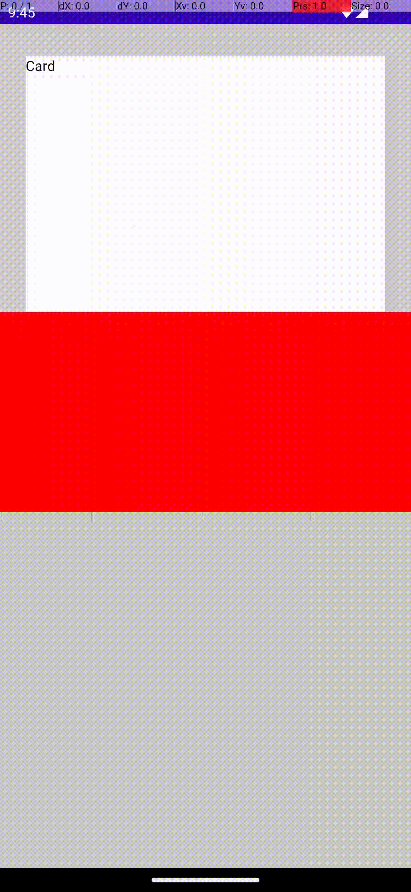
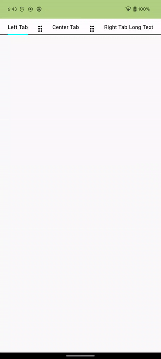
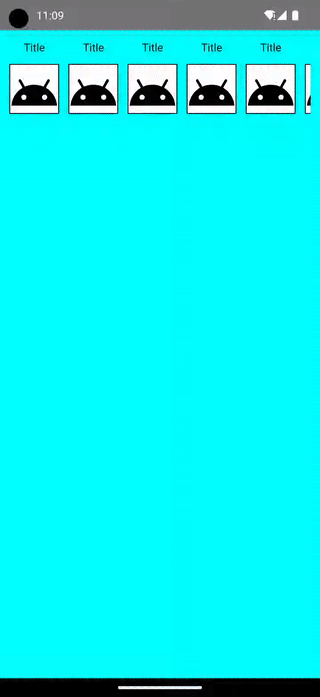

# Canvas PieChart

src path ../PieChart

 

# LotationCard
src path : ../ZlotationCard

 

# transforming content sample

 

# custom layout three tab
src path : ../TabRow

 

# Swipeable Card Sample
src path : ../GestureAndRotation

 

# Container Transition

 

# LottieAnimationSample ,ScrollSample

https://github.com/kkhouse/MVIKotlin-DecomposeSampleApp

