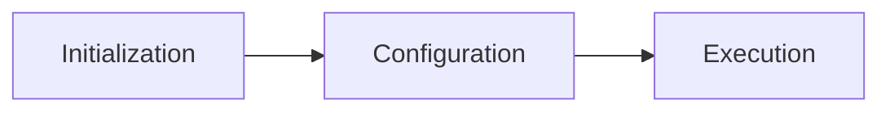

# Gradle 色々まとめたり比較したり

疑問点五月雨
- プロジェクトとは?,タスクとは?
- gradle処理の一連の流れは?

- srcとは?
- srcSetとは？
- モジュールとは？

- composit buildを学ぶ

## プロジェクトとは
>ビルドファイルからGradleと対話するために使用する主なAPIです。Projectから、Gradleのすべての機能にプログラム的にアクセスすることができます。
Initializationフェーズで、ビルド設定を確認したのちに作成されるGradleとの対話インターフェース
setting.graldeでinclude(project) のproject
雑にいうと、build.gradleを所有しているディレクトリはプロジェクトである
- Project と build.gradleは1:1
- 初期化時の流れは、Settingsオブジェクトの作成 -> setting.gradleを元にSettingsオブジェクトを設定 -> Settingsオブジェクトを使用してProjectの階層を作成 -> build.gradleを実行して各プロジェクトを評価する。
- Taskオブジェクトの集合体である。
- Androidのマルチモジュールという文脈はこっちではマルチプロジェクトという文脈に置き換えができる。
マルチモジュールはディレクトリに複数入ったプロジェクトがあった時のディレクトリのことも指している。
>プロジェクトが何を表すかは、Gradleで何をするかによって異なります。 例えば、プロジェクトはライブラリJARやWebアプリケーションを表すかもしれませんし、他のプロジェクトが生成したJARから組み立てられた配布用ZIPを表すかもしれません。 
### Settingsオブジェクトとは
>ビルドに参加するプロジェクトインスタンスの階層をインスタンス化し、設定するために必要な構成を宣言します。
- Settingsインスタンスとsetting.gradleが1:1

### Taskオブジェクト
>各タスクは、クラスのコンパイル、ユニットテストの実行、WARファイルの圧縮など、基本的な作業を実行します
- Taskの作成や検索はドキュメント参照
>タスクは、ビルドが実行するいくつかの原子的な作業を表します。 これは、いくつかのクラスのコンパイル、JARの作成、Javadocの生成、リポジトリへのアーカイブの公開などかもしれません。

## gradle処理の一連の流れは?

- 初期化 : setting.gradle検出、評価、プロジェクトとインクルードビルドの決定 、プロジェクトインスタンス作成
- コンフィギュレーション: プロジェクト内のすべてのビルドスクリプトの評価、タスクグラフの作成
- エグゼキューション：選択した各タスクを依存関係のある順にスケジューリングして実行
特徴
- ビルド時に上記流れが発火するとInitialization,Configure,Excutionが順に起こる
- 各フェーズでスクリプトが評価されるので pring とか書いておくとpringされる
- doLast や doFirstで包んだ関数は、そのタスク自身を実行しないと評価されない。 <- あまり直感的でないが。。

キャリアチェンジに関しても多め。
成功確率60%くらい
トータル3年くらい

待機リスク
- 何も決まらなくて待機になっちゃいました。

3000 側はわかる
5~6000 自分でやっている
8000 