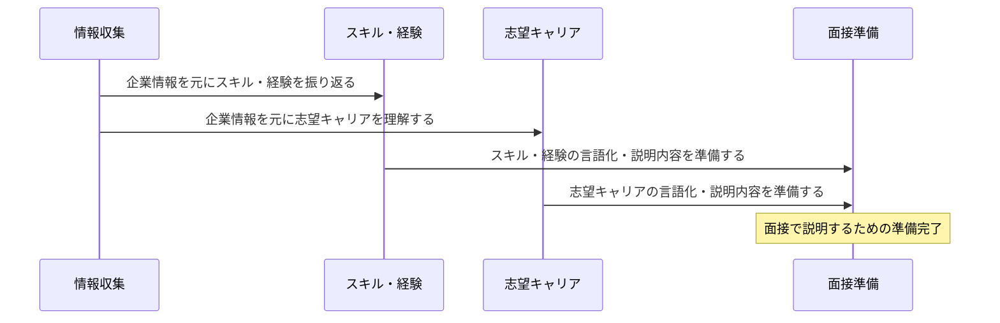

### 要約:
- 最終面接で企業で何がやりたいか、その理由、スキル・経験・姿勢を説明できるようになる

- 一次面接でスキル・経験の説明、志望キャリアについて、企業に関する情報収集を準備する

### TODOリスト:
- 企業に関する情報収集
- スキル・経験の振り返り・言語化
- 志望キャリアの理解・言語化
- 面接で説明する内容の準備

### フロー図 (Mermaid Markdown):



上記のフロー図は、情報収集から始まり、スキル・経験と志望キャリアの理解・言語化を行い、最後に面接で説明する内容を準備する流れを示しています。


### 採用資料を読んでいて浮かんだこと https://speakerdeck.com/hatena/engineers-recruitment?slide=4

- コンテンツプラットフォームサービス（いじってみる）
    - はてなブログ 
        - 書きたい人向けのもの
    - はてなブックマーク
        - Webページがどれだけ人気なのかわかるサイト
        - 検索アルゴリズムはGoogle?
        - 収集したい人向けのもの

- オウンドメディアサービス
    - オウンドメディアとは.mdにまとめる

- テクノロジーソリューションサービス
https://hatena.co.jp/recruit/interview/mangaapp
これめっちゃ魅力的、後でまとめる
>アプリ側だけでなく、サーバーサイドもやってみたいということであれば、それもありですね。
これめっちゃわかる

エンジニアバリューズ
プロダクト志向
コラボレーション
面白さ
挑戦
学びとオープンネス
- > 学び続けること ここのフォーカスが大好き

カルチャー
- 技術が好き
- 挑戦が好き
- 笑顔が好き
- はてなが好き
- インターネットが好き

情報オープン資料が見たい


はてなでやっていきたいこと
- AI使ったサービスをなんかしら開発したいなぁって妄想をしている
- スタートはアプリエンジニアですが、割とディープなところもやってきたと思ってます。
カメラやら音声やらをBinary形式で扱ったりとか、iOSライクなデザインにするためにComposeのUI部品をカスタムしまくったりとか。。。
- 関数型プログラミングが好きです。宣言方が評価されていっている風潮の中、ComposeはじめUIのライブラリが宣言チックな記法なので、ロジックもそうすべきっていう過激派志向を持っています。
提出物のMonadResultやResourceみたいな書き方です。
これの導入前と後でバグ発生やデバッグが容易になり、流れが追いやすく読みやすくなったって経験を今いる案件でしてきました。
まだこの考えが入っていないのであれば積極的提案していきたいなって思ってます。


①スキル・経験の説明に関する事
スキル・経験をはかるために、提出物をベースにディスカッションがございます。
準備としては
・サービスやシステムそのものの目的（何を実現させるためのものか？）
↓
```
サービス目的
- AIとの音声英会話
- 簡単な会話の窓口
似たようなサービスはあるが、音声認識にもAIを使っているのはまだ稀な様子。

個人の目的
ユーザの音声データを取得すること
 -> 知り合いをAIモデルに憑依させたい
    -> 性格
    -> アバター
    -> 声 <- これを収集する
```

・アーキテクチャやフレームワーク、ライブラリ、ツール、どういう意図でコードを書いたかなどの説明と選定理由
-> 
```
# サーバーサイド
アーキテクチャ：
- レイヤード（クリーン）あーき
- プログラム手法：宣言型、関数型プログラミングチックなコード
フレームワークやライブラリ
 - ビルドツール：gradle - マルチモジュール
 - 通信:Ktor
 - DB: Kotlin.Expose, （MySQLサーバ）
 - その他：arrow(関数型Kotlinライブラリ), Koin(DI)

 # フロントエンド
アーキテクチャ
KMMによるモジュール構成
- UI層：ViewModelにてFlowのState監視によるUI更新を行う
- Shared層：パッケージにて分割されたクリーンアーき,
- プログラム手法：宣言型、関数型プログラミングチックなコード
Shared : Ktor, Koin, 
Android : JetpackCompose , Material3, composedestination(navigation系), 
iOS : SwiftUI, 
音声系：ffmpeg

# 外部サービス
- SpeechToText
- OpenAI ChatCompletion
- GCP Storage

 選定理由
 - 関数型は好みなところもありますが,現在の案件先で積極的に使ったところバグも少なくデバッグも容易になった。なにより処理の流れが追いやすくて読みやすい。学習コストはやや高め？
 - ライブラリは機能実装において必要なもので新しめのものをピックアップ 
    -> DBは最初、SQLDeligtでやったがMYSQLと相性悪かったのでやめた。
    -> フロントのアーきもRudex系をベースにしたものを検討したがiOSへのデータ渡しではまったのでこちらにした
 - 特にUI層は、もはやメジャーとなりつつあるあたらしめのUIライブラリで、最近はこれでしか書いていない。

 # 管理
 Github カンバン
 https://github.com/users/kkhouse/projects/3/views/1?layout=board

 主にTODOややりたいこと浮かんだことを殴り書きしておくところ

```
　選定理由を問う事で、技術の理解（知識の幅や深さ、実行力があるかどうか）を確認する意図があります。

・苦労したことや失敗したこと、工夫したこと
-> 考えてから書く、書いてから考えるのバランスをとにかく意識した。
    -> 関数型では特に重要で、この層ではどの型で返すのが理想かを常に意識した
    -> DB設計は初だったので、シーケンスやらデータ設計をMarkDownでまとめた.
-> 音声データの扱い
    -> 想定通りいかないことが多かった。以下はなぜかデータが欠落することが多かった。逐一一次ファイルに変換して対応したところうまくいった。
        - バイナリ -> flac形式の変換
        - Base64への変換
-> KMMはアプリ側の複雑性が大きくなるデメリットがあると思った、のでサーバを噛ませた。 

・そこから得られた経験や考え、今後に活かしていること　など
 => かんばんの管理が楽、やることはめっちゃ増えていく。
 -> 音声データのあつかい -> バイナリの操作はカメラのImageAnalysys等でやったことはある。似たようなものだったが、各種フォーマットの違い等を学べて面白かった
=> KMMを使っていきたい。ロジックが同じ＝Androidで一通りテストしてロジック固めて仕舞えば、iOSはUIを作るだけで済んだ。これは生かしていくべき。作業時間が恐ろしく短くなる。
-> 今後の展望


②志望しているキャリアについて

「どうして転職活動をしているのか？」
「選考に進まれた理由は何か？」
「転職を考えている理由は何か？」

という主旨の質問がございます。

これは、主な意図としてはその方の仕事に対する考えや今後のキャリアのイメージを知るということと、興味関心や考え方を知りたいという意図です。
ここでは、ご自身の今後のビジョン（その理由）とそのビジョン達成のためにおける課題・ギャップは何かを順を追って説明してください。
そのうえで、ギャップを埋めるためにどんな環境でどんなチャレンジをしようと考えているのかをお伝えください。
-> 「どうして転職活動をしているのか？」「選考に進まれた理由は何か？」
1, Qiitaへの投稿で出会う機会をいただいたこと
大きなきっかけ。技術の勉強が好きで平日休日問わず何かしらやっているのでQiitaへの記事投稿を時々OutPutでおこなっていた。その記事をたまたま見てくれたエージェントの方からメールがあり紹介された行に惚れた。
2, はてなさんの以下が魅力
- 技術スタックの高さと技術スタックの更新に壁がなさそうなこと
Compose、SwiftUIなこと。それを積極的に取り入れにいっていること。
iOS-Android - サーバーサイドの垣根がないこと。 <- こっちが魅力
    私の案件はかなり大規模なのでアプリはアプリ担当って形で分かれてしまっている。業務要件は念頭におきつつもデータの扱いはサーバだし、デザインはデザイン。
    MaterialDesignを採用せず、AndroidもiOSによせにいくというデザインなので最初はUI部品をカスタムして共通的に作っておく、そもそもComposeなので新しめでおもしろい、リニューアルアプリなので技術選定から関われた、といった勉強にもなる面白いことが多かったが今は頭打ち。iOSもやや関わってたりするが、はてなさんの環境が欲しいと感じた。
- 学びとオープンネス
エンジニアとして当たり前って言われるこれが定着している雰囲気を感じたこと。毎週勉強会をしていること。はてなさんの核がこれに感じる
 -> オウンドメディアマーケティング、はてなブログを筆頭に情報を外に出すことをマネタイズしてきた実績、外に出すことで社風が知れるので転職の際の情報収集にとても面白みがあり、ここではたらきたいというビジョンが浮かんだび、わくわくしたこと。
- 技術と挑戦
今回提出したソースは途上ながらも挑戦しました。
AI系のAPIがきてすぐそれを使ってみた。
細々と勉強していたKMMでやってみた。
SwiftUIはチュートリアルレベルの知識だったがとりあえず入れてみた。
今後の展望もWearOSへの対応や、集めたデータでAIモデルを作りにいくなどの技術への挑戦が多い。そんな私にぴったりな気がする。

>ご自身の今後のビジョン（その理由）とそのビジョン達成のためにおける課題・ギャップは何かを順を追って説明
核
- 技術に触れ続けて生きていきたい
- 技術領域でリーダーになっていたい。
といった核があります。今の案件でもチームのテックリーダ的なポジションをやってました。自身で開発もしつつ、Rvをやるってことを頻繁にやっていてそれが好きでした。
最近は落ち着いてきてしまったのと、案件先も人を絞るフェーズに入り、技術に触れる機会が減ってきています。他案件もいまの会社ではない状況です。
個人でやるのは当たり前として、仕事でも新しい技術に触れ続けるキャリアを積んでいきたい。

あと５年くらいはDevとして生きていたい。その後も技術領域のリーダ的なポジションにいたい。と思ってます。
リーダーになりたい理由はシンプルに適性があるからです。


③企業に関する情報収集について

企業HPは必ず熟読し、事業内容やミッションを理解しておく。

企業HP、ニュース記事をチェックし、以下のポイントについて『整理』をお願いします。

企業の取り組み事例などをはじめ、ある程度企業理解をしたうえで当日はフレームワークの答え合わせのような感じで臨まれ、面接を通してさらに深堀理解できると BEST です。

Point １．同社のビジネスについての理解を深める

・どのようなクライアント・ユーザーに、何を、どのように販売・提供しているのか。

・同社の強みだと思われる点はどこになるのか。

Point ２．仕事内容について理解・予測・イメージしておく

・企業は、中途入社の方にどのようなことを期待しているのか。