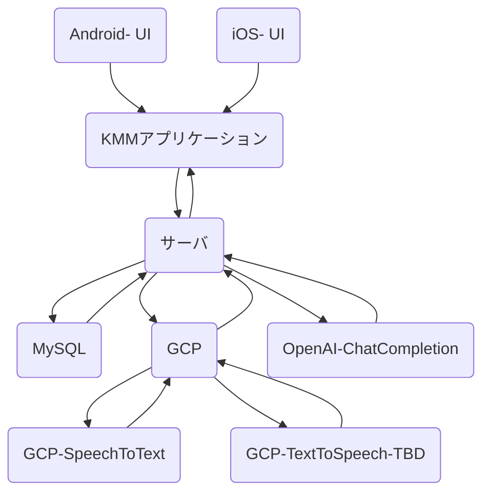
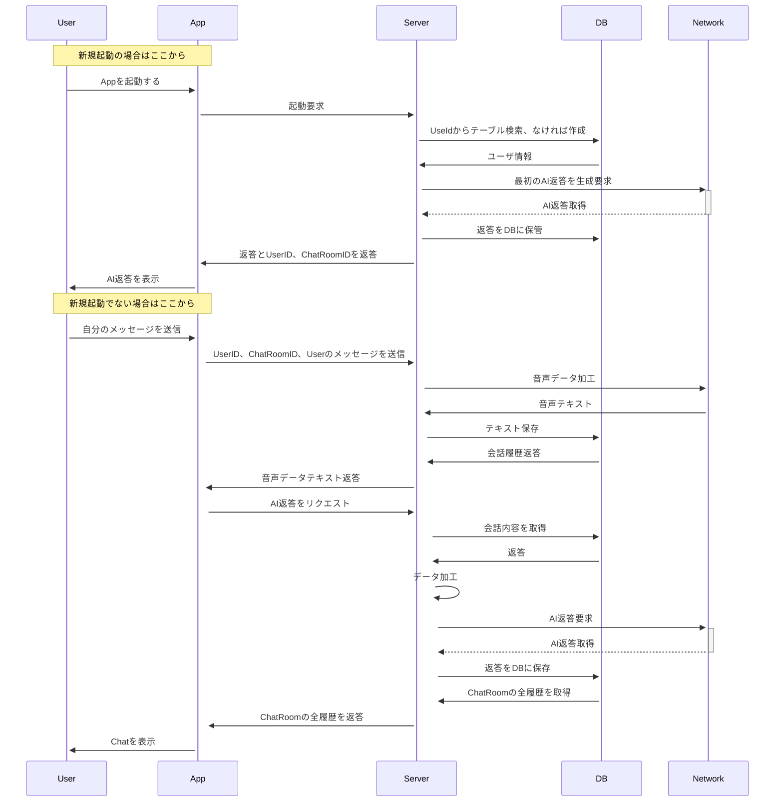

# システム図
（てきとう）

<br><br>



他、サーバーやDB設計はサーバ.md, データベース.md

### QA
- なぜサーバを噛ませているのか
    - クライアントサイドをシンプルにするため
        - KMMのマルチプラットフォームを意識 -> 「アーキテクチャ・ライブラリ」で後述
    - 将来的にはサーバをそのままCloudRunに突っ込めるので後悔する上でもボトルネックにはならなそう
- DBの役割は？
    - ユーザのチャット内容を保存
- Networkの役割は？
    - GCP Cloud Strageへのユーザの音声データ保存
    - TextToSpeechリクエスト
    - ChatCompletionへのリクエスト
<br><br><br>

# 目的

## サービス目的

- 音声を使った特定の目的に特化したAIとの会話窓口
    - 想定ユーザ: プロンプトの数だけ多岐に渡らせることも絞ることもできる
        - 習熟度別の外国語会話ルーム？
        - ほか、特定分野の専門家と会話できるような雰囲気の部屋？
```
※ ただし、（音声認識にGCPのトレーニング済みモデルを使っているサービスは少なめ気がしつつも、）類似のサービスはいっぱいある。その意味では'サービス'としての価値は限定的。個人的に主な目的要素は以下が大きい。
```
<br><br>

## 個人的なシステムの目的

### 「知り合いをAIモデリングしたい」
```
イメージ：
スマホ上に友人をアバター描画して、そいつと対話するって仕組みを作りたい。
```

#### 必要なもの
- 性格：プロンプトエンジニアリングの試行錯誤で近づけることはできそう
- 外観：SNS等で画像や動画はデータとして取得できそう
-  声: **当アプリ** で収集
    - VertexAI（AutoVM）による学習で準備できるかもしれない

```
いずれも、データさえ揃えればVertexAIで機械学習をローコードで行えるのでは？と発想している。
そのためにも「声」のデータが自然な形で欲しかった。そのためのアプリをこれを機に作ろうと思った
```
<br><br><br>

# アーキテクチャ・ライブラリ

## サーバーサイド
- アーキテクチャ： レイヤード（クリーン）アーキテクチャ
- プログラム手法: 宣言型(関数型)プログラミングを意識したコーディングスタイル
- フレームワークやライブラリ
    - ビルドツール：gradle - マルチモジュール
    - 通信:Ktor
    - DB: Kotlin.Expose, （MySQLサーバ）
    - その他：arrow(関数型Kotlinライブラリ), Koin(DI)

## フロントエンド
- アーキテクチャ:MVVM+クリーンアーキ
    - UI層：宣言型UIライブラリ + sharedのViewModel
    - Shared層：クリーンアーキ（＋ViewModel) 
- プログラム手法：宣言型(関数型)プログラミングを意識したコーディングスタイル
- フレームワークやライブラリ
    - 全体: Koin(DI)
    - Shared : Ktor, Realm, 
    - Android : JetpackCompose, ComposeDestination(TBD)
    - iOS : SwiftUI, 
    - 音声系：ffmpeg(Android, iOS)

## 外部サービス
- SpeechToText
    - GCPの音声データをテキストに変換するAIモデル込みのAPI
- ChatCompletion
    - OpenAI。
- GCP Storage
    - 音声保存用ストレージ
- GCP SQL（TBD)
    - お金が結構かかったので閉鎖中。。

 ### 選定理由
 - 関数型は好みなところもありますが,処理の流れが追いやすい,プログラムが書きやすいので採用。
    - -> arrowライブラリはEitherを使用するため。他、型クラスを自作している（MonadResult.ktとResource.kt）
 - ライブラリは機能実装において必要なもので新しめのものをピックアップ 
    - -> DBは最初、SQLDeligtでやったがMYSQLと相性悪かったので、昔からあるExposeで行った。
    - -> フロントのアーキテクチャもRudex系をベースにしたものを検討したがiOSへのデータ渡しではまったので通常のMVVM＋UseCaseという形にした
 - 特にUI層は、もはやメジャーとなりつつあるComposeとSwiftUI（WIP）で行った。（最近はこれでしかやってないのでXMLなどの昔の言語にはもどれない気がしてる。）
 - KMMは学習中であったためここでも取り入れて理解を深めるのが目的

 ## 管理系
 Github カンバン
 https://github.com/users/kkhouse/projects/3/views/1?layout=board

 - 主に作業単位のTODOやWantを置いておくところ