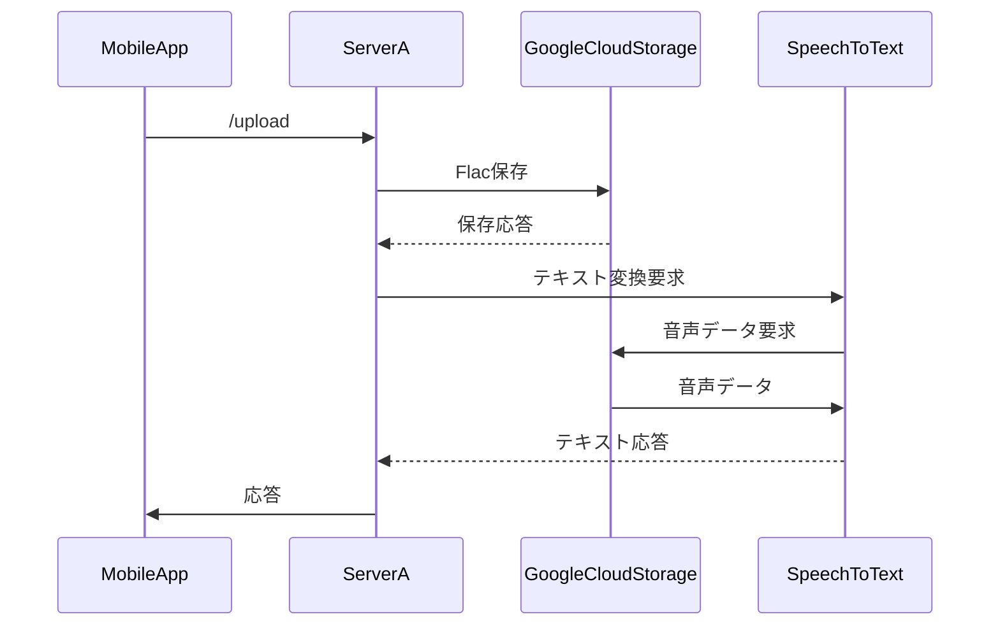

# サーバー
## クライアントとのリクエスト- レスポンス

### initilize リクエスト
- リクエスト
```
/initilize
POST
application/json
```
```json
{
  "userID":1234, // nullable
  "appChatRoom":012
}
```
```
appChatRoom : 0~
IF上はどのチャットからきたかを定義する
0: 英会話
1: 検索
2: 〜〜
```

- レスポンス
```json
{
  "userId": 1234,
  "appChatRoom":012,
  "conversation":[
    {
      "role":012,
      "message":"message"
    }
  ],
  "errorCode":012
}
```
```
errorCode
0: 
1:
2:
```

### upload リクエスト
- リクエスト
```
/upload
POST
application/json
```
```json
{
  "userId": 1234,
  "appChatRoom":012,
  "userFlacData":"byteArray"
}
```

- レスポンス
```json
{
  "userId": 1234, // required
  "appChatRoom": 5678, // required
  "speech":"speech",
  "errorCode":012
}
```
```
errorCode
0: 想定外
1: チャック数が多すぎ
2: テキストの結果が複数
```

### speechToText リクエスト
- リクエスト
```
/aiSpeech
GET
application/json
```
```json
{
  "userId": 1234, 
  "appChatRoom":012,
  "speech":"speech",
}
```

- レスポンス
```json
{
  "userId": 1234, // required
  "chatRoomId": 5678, // required
  "errorCode":012,
  "conversation":[
    {
      "role":012,
      "message":"message"
    }
  ],
}
```
```
role
1: Assistant
2: User
```
```
errorCode
0: 想定外
1: チャック数が多すぎ
2: テキストの結果が複数
```

## 外部システムとの通信

### GCP
- Storage, SpeechToText

関連API：upload


- Q Storageかませず、アプリでエンコードして直にSpeechToTextでいいのでは？
  - A Curlだとうまくいくが、Kotlinのエンコードだと返答されるテキストが空になった。原因不明だが、エンコードの過程で何らかのバグがありそう。不採用。


### OpenAI ChatCompletion

関連API: speechToText

テキストをリクエストするだけなのでシーケンス割愛