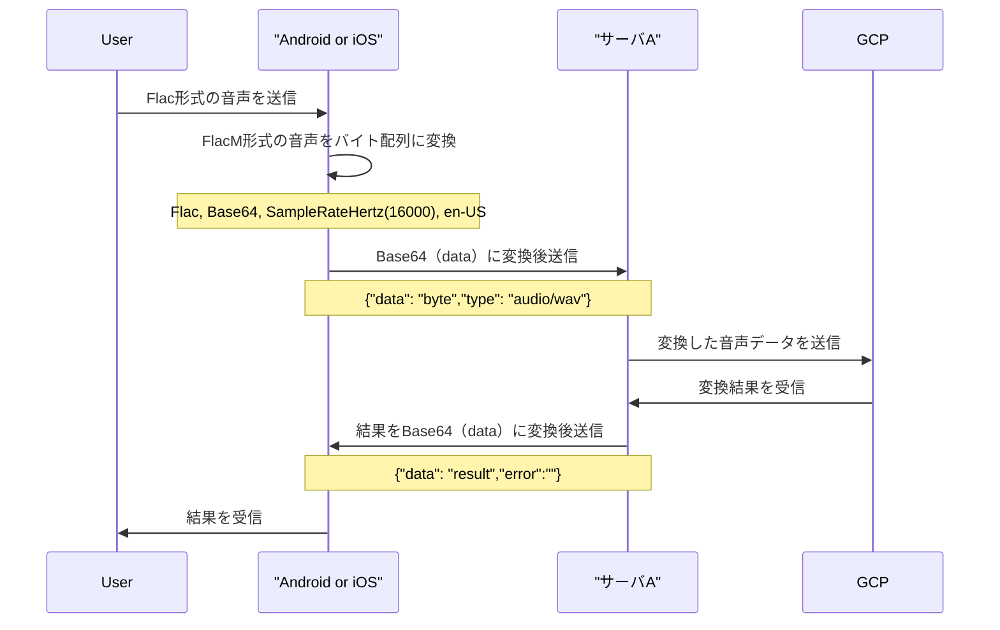
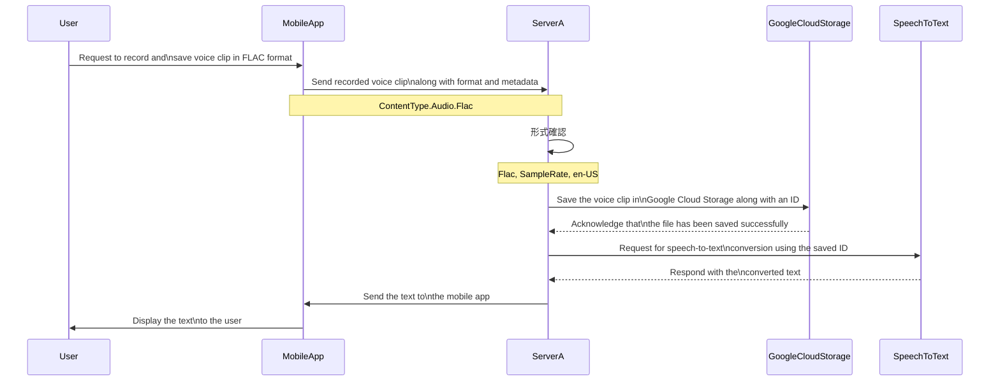
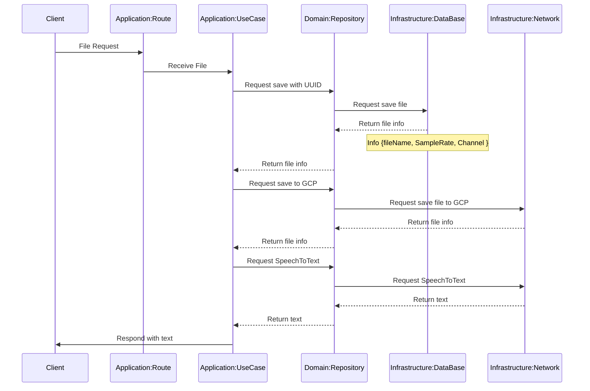

### 音声データのシーケンス図
ボツ
これはFlac形式の音声データをBase64のbyte配列にして送付するがその変換の過程でなんらかの文字情報が欠落する様子でKotlinと相性が悪い様子。Curlだとできるがこの方法は保留


採用
- サーバーをかます理由 : SpeechToTextのクライアントライブラリがモバイルに対応していない。
- サーバサイドの勉強



クライアントとのリクエスト- レスポンス
- リクエスト
```
Content-Type: audio/any or flac
body: flacBinaryData
```
- Response
```json
{
  "text":"recognition result text , notNull",
  /**
  * @param errorCode
  *  0 : 想定外
  *  1 : チャンクが多い
  *  2 : 空文字レスポンス or 結果が複数の異例ケース
  */
  "errorCode":"Int: 0~2, nullable"
}
```

ServerAのファイル保存->テキスト生成俯瞰



### サーバAのChatAPIの仕様
リクエスト
```json
{
  "userId":"user id"
  "text":"new users message"
}
```
レスポンス
```json
{
  /**
  @id : 会話順 0~ インクリメント
  @role : 0: assistant, 1: user
  */
  "conversation":[
    {
      "id":"int",
      "role":"int: 0,1",
      "message":"string: message"
    }
  ],
  
  /**
  * @param errorCode
  *  0 : 想定外
  *  1 : トークン数が多すぎる（しゃべりすぎ）
  *  2 : chatAPIのfinish_reason が stop以外(なんらかの生成エラー?)
  */
  "errorCode":"Int: 0~2, nullable"
}
```
チャット系
- 永続化する。
スキーマ定義
