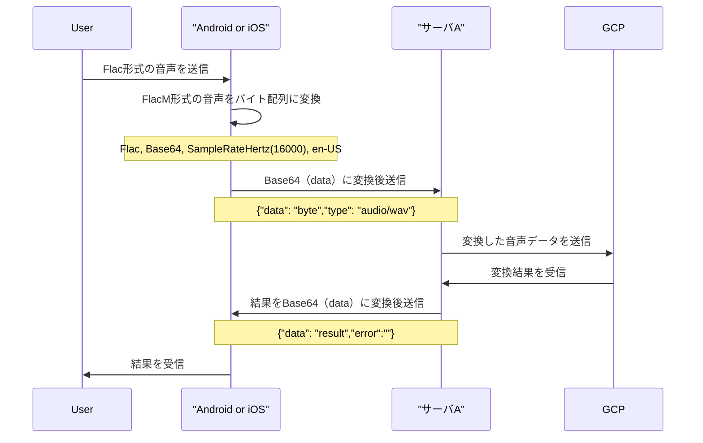
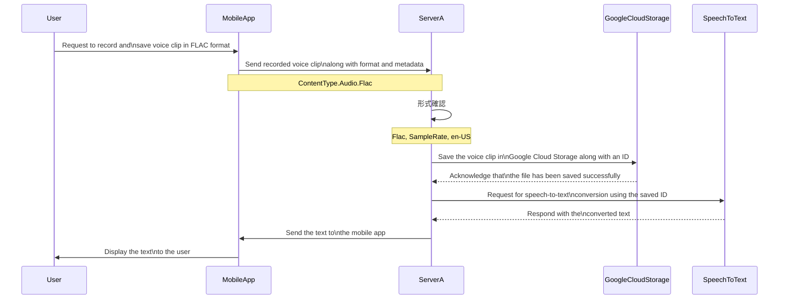
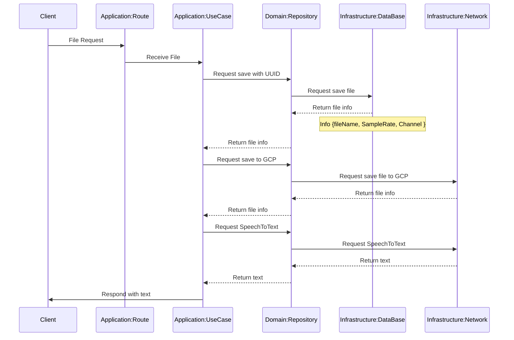

### 音声データのシーケンス図

これはFlac形式の音声データをBase64のbyte配列にして送付するがその変換の過程でなんらかの文字情報が欠落する様子でKotlinと相性が悪い様子。Curlだとできるがこの方法は保留

以下にて方針転換
- サーバーをかます理由 : SpeechToTextのクライアントライブラリがモバイルに対応していない。
- サーバサイドの勉強

ServerAのファイル保存->テキスト生成俯瞰

