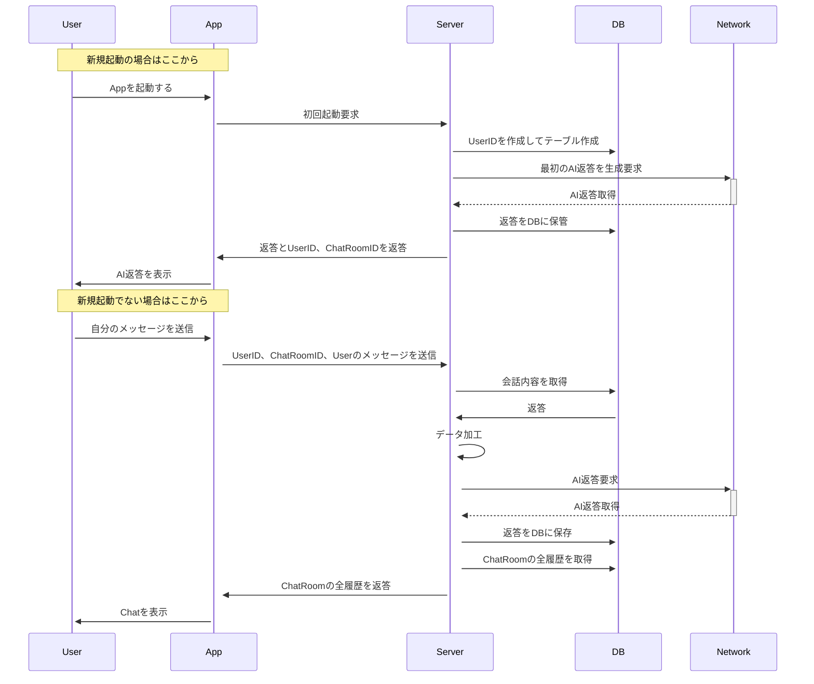

# システムシーケンス

#### Entity
- User
- App
- Server
- Network
- DB

#### データ
- UserID : ユーザに一意のID
- チャットルーム: ユーザが複数持っているチャットルーム
- チャット履歴: チャットルームに紐づくチャット履歴
- AIメッセージ: AIから取得するメッセージ

### シーケンス

```mermaid
sequenceDiagram
    participant User
    participant App
    participant Server
    participant DB
    participant Network
    Note over App, User: 新規起動の場合はここから
    User->>+App: Appを起動する
    App->>+Server: 初回起動要求
    Server->>+DB: UserIDを作成してテーブル作成
    Server->>+Network: 最初のAI返答を生成要求
    Network-->>-Server: AI返答取得
    Server->>+DB: 返答をDBに保管
    Server->>+App: 返答とUserID、ChatRoomIDを返答
    App->>+User: AI返答を表示
    Note over App, User: 新規起動でない場合はここから
    User->>+App: 自分のメッセージを送信
    App->>+Server: UserID、ChatRoomID、Userのメッセージを送信
    Server->>+DB: 会話内容を取得
    DB->>+Server: 返答
    Server->>+Server: データ加工
    Server->>+Network: AI返答要求
    Network-->>-Server: AI返答取得
    Server->>+DB: 返答をDBに保存
    Server->>+DB: ChatRoomの全履歴を取得
    Server->>+App: ChatRoomの全履歴を返答
    App->>+User: Chatを表示
```
