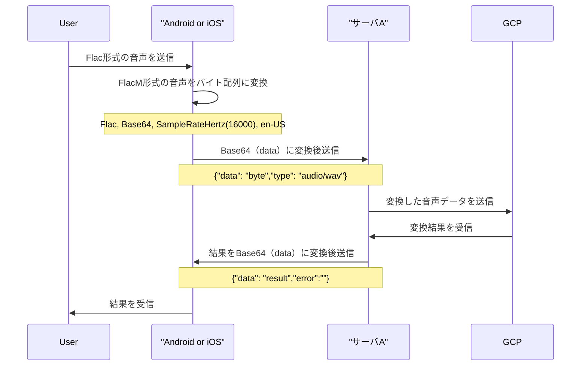

## 音声データのシーケンス図
### ボツ案
これはFlac形式の音声データをBase64のbyte配列にして送付するがその変換の過程でなんらかの文字情報が欠落する様子でKotlinと相性が悪い様子。Curlだとできるがこの方法は保留

```mermaid
sequenceDiagram
    participant User
    participant App as "Android or iOS"
    participant ServerA as "サーバA"
    participant GCP

    User ->> App: Flac形式の音声を送信
    App ->> App: FlacM形式の音声をバイト配列に変換
    Note over App: Flac, Base64, SampleRateHertz(16000), en-US
    App ->> ServerA: Base64（data）に変換後送信
    Note over App,ServerA: {"data": "byte","type": "audio/wav"}
    ServerA ->> GCP: 変換した音声データを送信
    GCP ->> ServerA: 変換結果を受信
    ServerA ->> App: 結果をBase64（data）に変換後送信
    Note over ServerA,App: {"data": "result","error":""}

    App ->> User: 結果を受信
```

### 採用案
- サーバーをかます理由 : SpeechToTextのクライアントライブラリがモバイルに対応していない。
- サーバサイドの勉強

