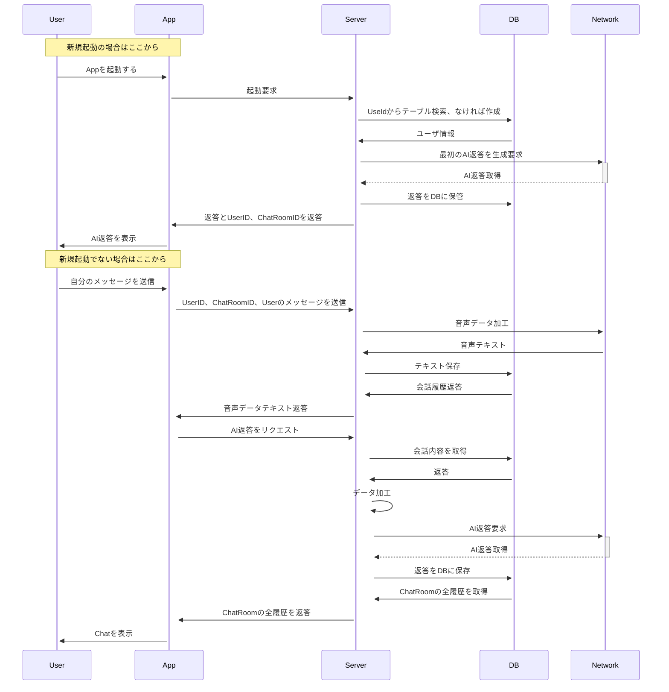

# システムシーケンス

#### Entity
- User
- App
- Server
- Network
- DB

#### データ
- UserID : ユーザに一意のID
- チャットルーム: ユーザが複数持っているチャットルーム
- チャット履歴: チャットルームに紐づくチャット履歴
- AIメッセージ: AIから取得するメッセージ

### シーケンス
目的: AIとの対話型インターフェースで英会話をする

### 背景
- なぜサーバを噛ませているのか
    - クライアントサイドをシンプルにするため
        - KMMのマルチプラットフォームを意識-> モジュール構成が最初から通常より複雑なのでできるだけこちらはシンプルにしたい
        - Sharedモジュール分割が難しかった
    - 将来的にはサーバをそのままCloudRunに突っ込めるので公開もまあ容易
- DBの役割は？
    - ユーザのチャット内容を保存
- Networkの役割は？
    - GCP Cloud Strageへのユーザの音声データ保存
    - TextToSpeechリクエスト
    - ChatCompletionへのリクエスト

