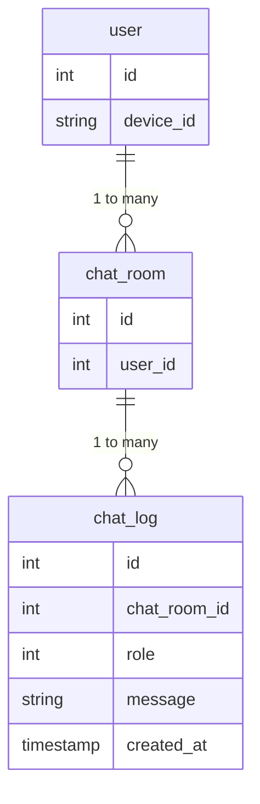

### チャットテーブル

chat_log

データ取得のSQL文の例：

特定のユーザーの全チャットルーム情報を取得する場合：
```sql

SELECT * FROM chat_room WHERE user_id = [ユーザーID];
```

特定のチャットルームの全メッセージを取得する場合：
```sql
SELECT * FROM chat_log WHERE chat_room_id = [チャットルームID];
```

更新のSQL文の例：

特定のメッセージの内容を更新する場合：

```sql
UPDATE chat_log SET message = [新しいメッセージ内容] WHERE id = [メッセージID];
```

削除のSQL文の例：

特定のチャットルームに属する全メッセージを削除する場合：
```sql
DELETE FROM chat_log WHERE chat_room_id = [チャットルームID];
```
特定のメッセージを削除する場合：
```sql
DELETE FROM chat_log WHERE id = [メッセージID];
```