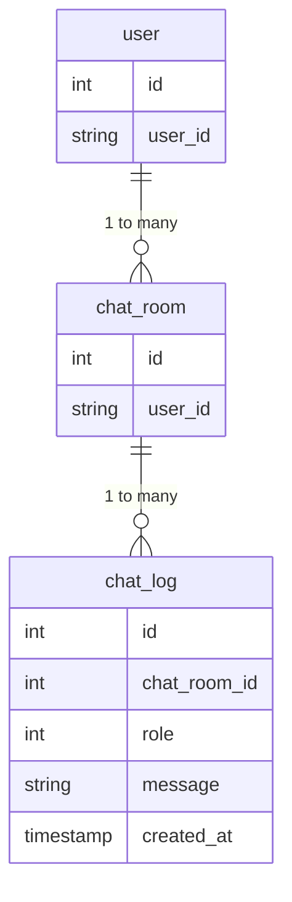

# データベース

## チャットテーブル
chat_log

- 音声の管理はGCPでやるのでシンプルにユーザとチャット履歴が保存できれば良い
- チャットルームは複数、チャットルームが複数の会話ログを持っておく形
- ルームに親子は作らない。作るような要件が出るならばそれはアプリごと変えちゃった方が良さそう。

### クエリ
```
CREATE TABLE user (
  id INT NOT NULL AUTO_INCREMENT,
  user_id VARCHAR(255) NOT NULL,
  PRIMARY KEY (id)
);

CREATE TABLE chat_room (
  id INT NOT NULL AUTO_INCREMENT,
  user_id VARCHAR(255) NOT NULL,
  PRIMARY KEY (id),
  FOREIGN KEY (user_id) REFERENCES user(user_id)
);

CREATE TABLE chat_log (
  id INT NOT NULL AUTO_INCREMENT,
  chat_room_id INT NOT NULL,
  role INT NOT NULL,
  message VARCHAR(255) NOT NULL,
  created_at TIMESTAMP NOT NULL,
  PRIMARY KEY (id),
  FOREIGN KEY (chat_room_id) REFERENCES chat_room(id)
);

```

削除
```
SET FOREIGN_KEY_CHECKS = 0;
TRUNCATE TABLE chat_log;
TRUNCATE TABLE chat_room;
TRUNCATE TABLE user;
SET FOREIGN_KEY_CHECKS = 1;
```
