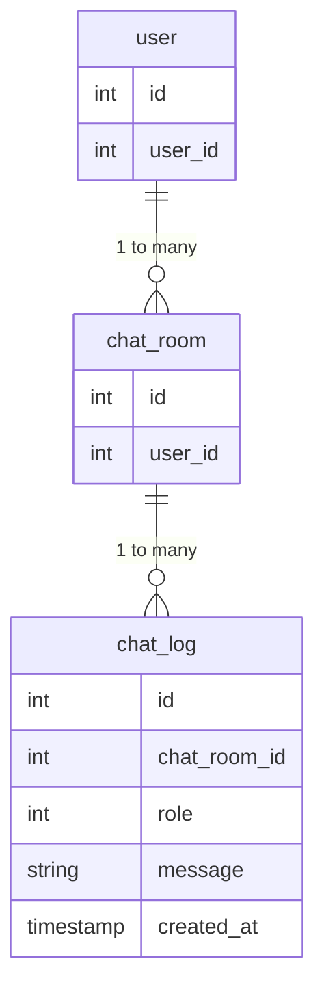

# データベース

## チャットテーブル
chat_log

```mermaid
erDiagram
    user {
        int id
        int user_id
    }
    user ||--o{ chat_room : "1 to many"
    chat_room {
        int id
        int user_id
    }
    chat_room ||--o{ chat_log : "1 to many"
    chat_log {
        int id
        int chat_room_id
        int role
        string message
        timestamp created_at
    }
```

### クエリ

- 