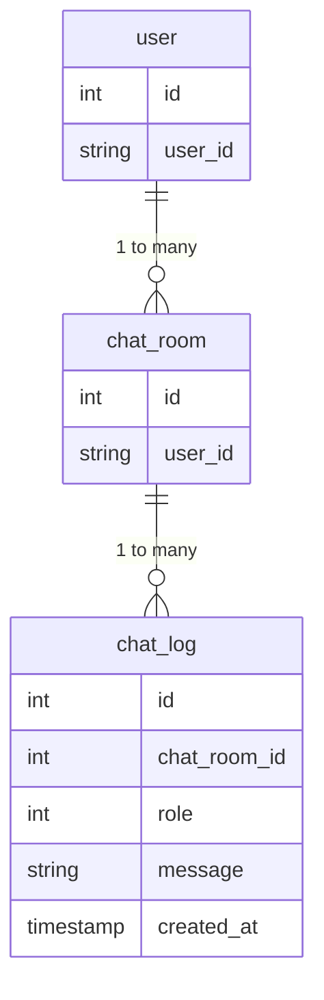

# データベース

## チャットテーブル
chat_log

```mermaid
erDiagram
    user {
        int id
        string user_id
    }
    user ||--o{ chat_room : "1 to many"
    chat_room {
        int id
        string user_id
    }
    chat_room ||--o{ chat_log : "1 to many"
    chat_log {
        int id
        int chat_room_id
        int role
        string message
        timestamp created_at
    }
```
- 音声の管理はGCPでやるのでシンプルにユーザとチャット履歴が保存できれば良い
- チャットルームは複数、チャットルームが複数の会話ログを持っておく形
- ルームに親子は作らない。作るような要件が出るならばそれはアプリごと変えちゃった方が良さそう。
