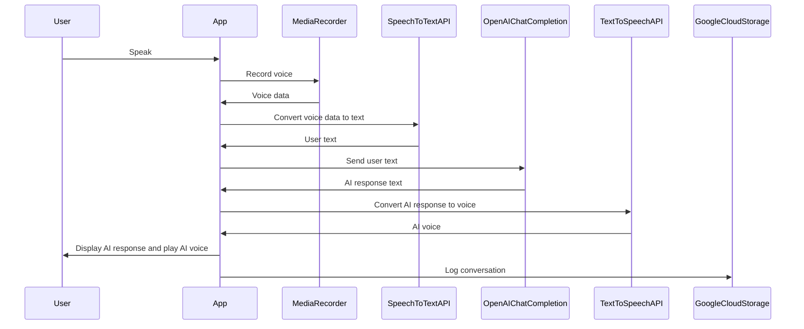

アプリを使用した英会話手順
- ユーザがしゃべる
- Android:MediaRecorderで音声認識
- SpeechToTextAPIでText化
https://cloud.google.com/speech-to-text?hl=ja
- OpenAI ChatCompletionへユーザの会話内容を送信
- 上記のレスポンスにて、AIの返答をUIに表示
- TextToSpeechAPIにてAIの返答のみ音声化
https://cloud.google.com/text-to-speech?hl=ja
- 完了と同時に、会話内容をGoogle Cloud Storage（GCS）にログ

↑までのシーケンス




KMMによるKotlin -> Swiftの変換

```swift
import SwiftUI
import shared

struct ContentView: View {
    @ObservedObject private var viewModel = MyViewModel()

    var body: some View {
        VStack {
            Button(action: {
                viewModel.incrementCounter()
            }) {
                Text("count : \(viewModel.counter)")
            }
        }
    }
}

class MyViewModel: ObservableObject {
    @Published private(set) var counter: Int = 0
    private let myKmmViewModel: MyKmmViewModel

    init() {
        myKmmViewModel = MyKmmViewModel()
        myKmmViewModel.stateFlow.watch { [weak self] count in
            self?.counter = count
        }
    }


    func incrementCounter() {
        myKmmViewModel.incrementCounter()
    }
}

```

TODO 
- サーバー側
    - 通信の仕様整理 
        - 実装
    - DB仕様整理 OK -> データベース
        - 実装
    - AIチャットの整理 OK -> システムシーケンス
        - 実装
- モバイル側
    - 通信仕様の整理
    - スキーマの整理

後回し
- KMMのロジック整理
    - Swift UIの仕組み
    - データ受け渡しがどうなっているか
        - プリミティブ
        - Collection
        - data型など構造体
        - 具象クラスのオブジェクト
    - 特にFlowの部分のiOSへの連携手法
    - シーケンスにまとめてしまうか


- FlacからのBase64データが取れない SpeechToTextImpl#postSpeechToText -> これは最悪なくても良い
```
curlでの取得は可能な音声データ
JavaClientを通すと出来なくなる。
```


あいであおきば💡💡
- TextCompletionで文法添削？
- チャットアイコンからSystemのプロンプトを変更可能にする
- FloatingActionButtonで会話のリセット
- PixelWatchで簡易英語翻訳くらいはやりたい
- folding or tablet にて添削の部分をできるようにする？
- 言語の変更が可能、イギリス英語かアメリカ英語かなど、UIの最初に設定させてしまえばよい
- ストリーム処理をしてみる?
- サーバー側 versionCatalog導入
- 精度が悪ければもう一度
- ファイル解析の抽象化
- データの圧縮やストリーミング
- 英語の音声を集める

苦労
- 文字コードにハマった 
 -> GCPで保存するやり方に変更

工夫
- 関数型プログラムを意識
- システムを作り上げてみるって思いでやる


Material Design 3 階層
色とフォントとShapeを追ってみる


